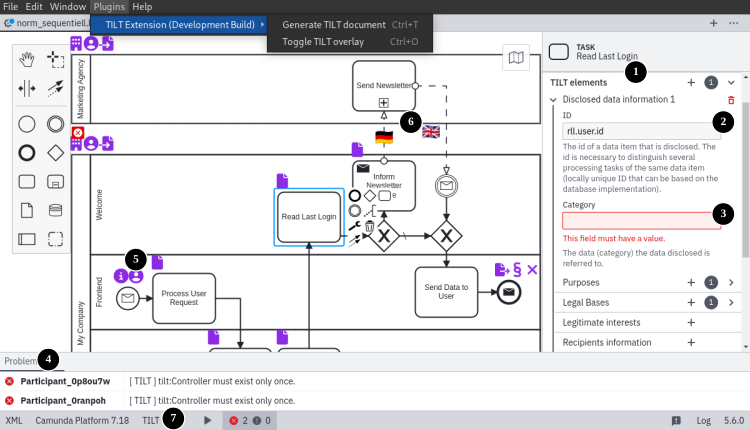
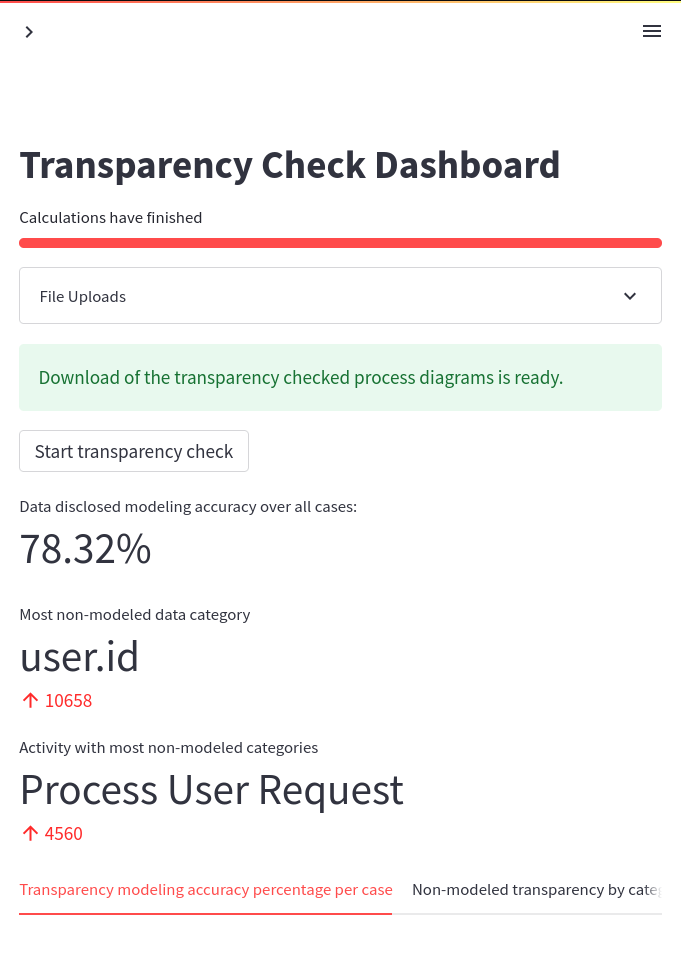
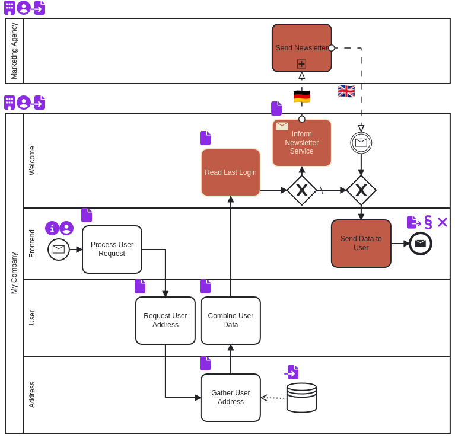

# Extending BPM for regulatory compliance
This is the top-Level repository that overarches the contributions of the "Extending business process management for regulatory transparency compliance" paper.

## Repository Contents
This repository contains the following submodules:

1. [Modeler Plugin](https://github.com/PrivacyEngineering/bpm-transparency-plug-in) / https://anonymous.4open.science/r/plug-in
2. [Logging Descriptor](https://github.com/PrivacyEngineering/bpm-transparency-logger-lib) / https://anonymous.4open.science/r/logger-lib
3. [Transparency logging microservice architecture example](https://github.com/PrivacyEngineering/bpm-transparency-demo) / https://anonymous.4open.science/r/demo-architecture
    - [Transparency Dashboard](https://github.com/PrivacyEngineering/bpm-transparency-demo/tree/main/src/mining-dashboard) / https://anonymous.4open.science/r/demo-architecture/src/mining-dashboard
    - [Demo Data](https://github.com/PrivacyEngineering/bpm-transparency-demo/tree/main/src/mining-dashboard/app/data/) / https://anonymous.4open.science/r/demo-architecture/src/mining-dashboard/app/data

## Contribution Overview
### _Video links are removed for review as they disclose the author names._

Click on the following image to view the paper presentation or view the video here: https://example.com (18:50 min)

### Camunda Modeler TILT Plug-in

Click on the following image to view an instruction video or view the video here: https://example.com (16:30 min)

Video Contents:
- 0:00 Plug-In Installation
- 2:27 Basic transparency property editing
- 4:53 Transparency modeling
- 7:24 Transparency problem resolving
- 9:41 Transparency modeling assistance
- 13:16 Transparency icon overlay
- 14:29 TILT Document creation

### Transparency Logging Microservice Architecture Example
Click on the following image to view a video of the demo architecture or view the video here: https://example.com (11:38 min)

Video Contents:
- 0:00 kubectl & git clone
- 2:13 System Installation
- 4:54 Elasticsearch Index
- 7:16 Jaeger
- 9:30 Example Query
- 10:40 Uninstalling

### Process Transparency Dashboard
Click on the following link to view a video of the transparency-dashboard: https://example.com (14:19 min)

|Dashboard|Transparency Checked Process|
|---|---|
|||

Video Contents:
- 0:00 Dashboard access
- 0:47 Event Log retrieval
- 2:20 Process Discovery
- 3:45 Transparency insights in Camunda
- 5:27 Working with discovered processes
- 6:56 Transparency Checking
- 10:47 Gaining insights from transparency-checked diagrams
